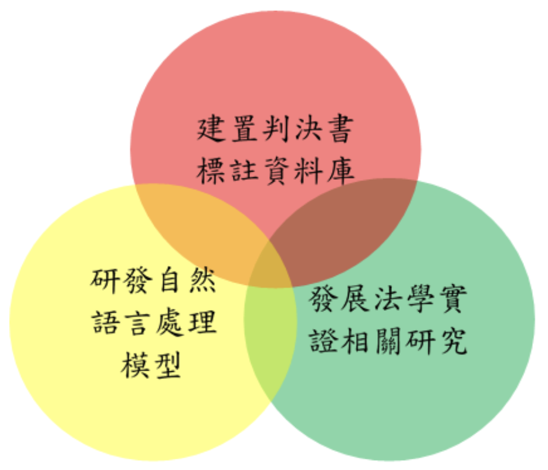
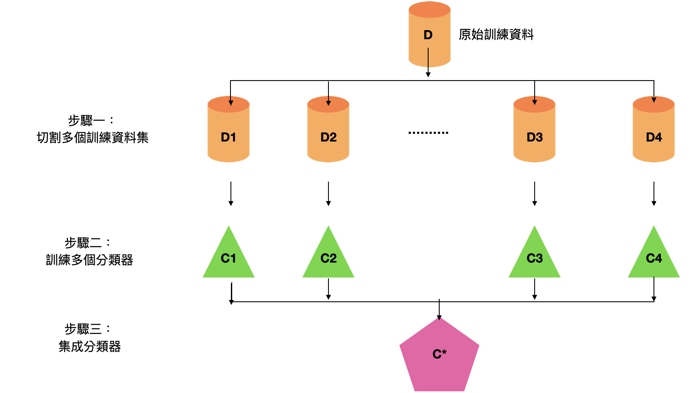
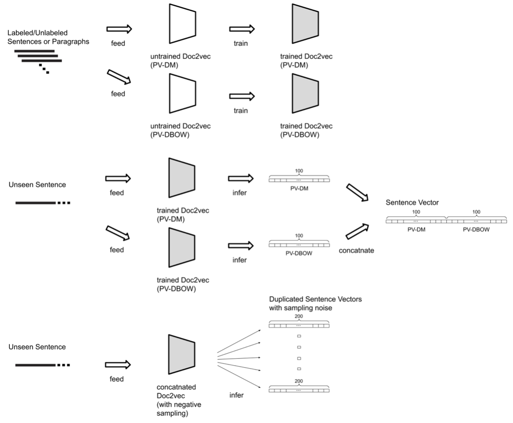
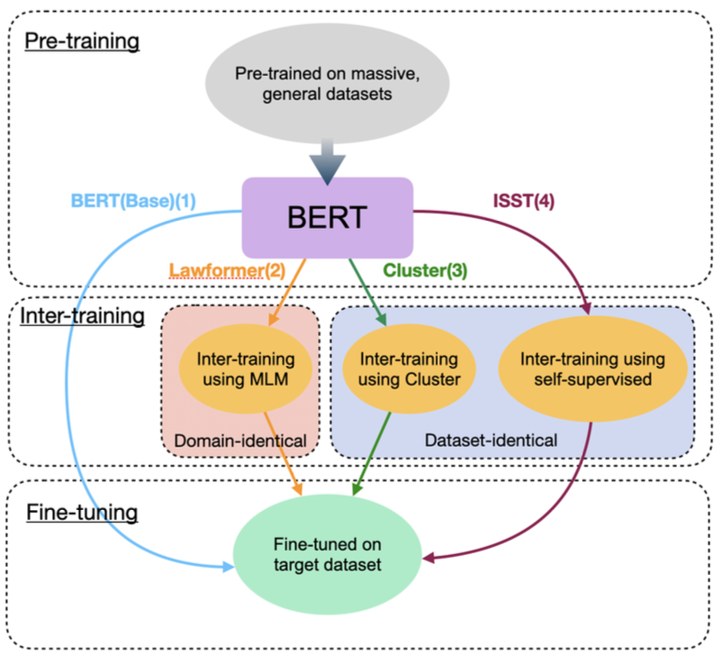
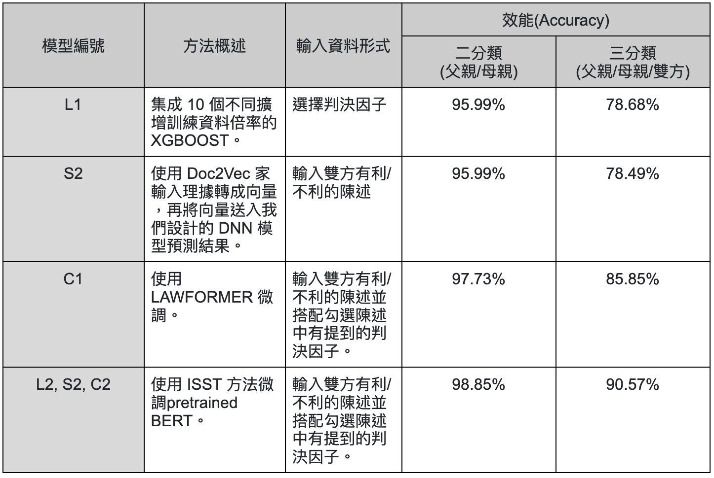

## 一、背景說明

人工智慧應用在人文與社會領域中有一個共同且困難的挑戰在於，絕大部分的人文社會資料是經由作者仔細思維後所寫作產生的文本(text)，是較不容易被標準化標註的資料型態。而文字意義的歧異性與許多非結構化的背景脈絡更增添機器學習的困難度。對此本研究嘗試提出一個解決方案，亦即從民事裁判著手，發展一套自然語言處理的流程來協助克服資料標註與分類的困難，未來亦可能應用到其他類型的文件分析。

如同所有人工智慧技術，訓練資料(Training Data)的特色與品質往往是決定其應用成效的首要因素。相較於其他類型的文本資料，法院裁判作為自然語言處理的應用有幾個好處：首先，裁判書類係由法學專業的法官所撰寫，以嚴謹的邏輯與法律用語處理社會之爭端。因此其用字遣詞不但有其條理性與穩定性，內容又可呈現出當代社會生活的情境。更重要者，我國為成文法國家，民法及相關法規相當詳盡，很適合做為機器學習的輔助；在司法實務上，多數民事案件也能加以類型化。因此，如果人工智慧能在民事裁判的判讀、分類與預測上有所進展，咸信有助於減緩一般民眾對司法裁判期待的落差，達到止謗息爭的果效，間接提升人民對司法之信賴。

## 二、計畫簡介

目前我們的研究先集中於研究親權裁定(即當父母雙方離婚後如何酌定子女的監護權)的案件。例如究竟民法1055-1條中所強調的「子女最佳利益」在司法實務上是如何被實踐評估，能否由AI來學習判斷？研究的三個大方向是(1)建構判決書的標註資料庫，(2)研發自然語言處理的模型，以及(3)發展法學實證相關研究。本計畫是屬於科技部AI人文社會領域計畫，由清華大學所執行的「競爭或合作？人工智慧在人文社會的應用與影響探究」總計畫中的子計畫一「可解釋性人工智慧在家事裁判之應用與其限制」。計畫執行期間為2019-2020。

本研究的判決書資料來自於司法院法學資料檢索系統。第一階段是蒐集2015-2017這三年間各級法院所有與親權相關的案件。此處的「親權相關」乃指全文帶有「離婚」、「審酌」與「子女最佳利益」的判決，共計2,620篇。未來會再擴展至其他年份與類型。我們先以人工的方式將這些判決書標註出「類型特徵」與「理據特徵」。前者包括判決結果、雙方意願、雙方身分、雙方國籍；後者包括對於雙方有利與不利的文字理由段落。有機會成為國內目前最詳盡的民事案件分析資料庫。這些資料形成原來判決書的「等效資料」，可以更方便地用來作進一步的量化與質性研究。其中也包括利用自然語言處理的方式來作判決預測。

## 三、模型輸入資料的介紹

本研究所開發的模型，皆是基於下列兩種標注資料作為模型輸入：其一為申請方與相對方各自有利/不利的理據，以及從雙方有利/不利的理據中，所標註出的十三個親權判決因子('親子感情', '意願能力', '父母經濟', '支持系統', '父母生活', '主要照顧','子女年齡', '人格發展', '父母健康', '父母職業', '子女意願', '友善父母', '父母品行')。

## 四、模型介紹與評估

在完整的資料收集和標註之後，我們開始著手於自然語言處理模型的研發。為了能夠充分探索並評估不同模型對於判決書的預測效果，我們在本網頁展示四種基於不同深度學習算法所開發的親權判決模型，分別是：模式一的 L1，模式二的 S1, 模式三的 C1，而在模式一、二、三所展示的 L2, S2, C2 則都對應到同一個模型。以下針對這五種模型的架構、算法以及效能進行詳細介紹：

- **(模式一)Model L1:**
  L1 為基於 XGBOOST 所開發的模型。XGBOOST 是一種優化的梯度增強機學習算法，它在多個機器學習競賽和實際應用中都有出色的表現。我們利用其對於非線性關係的建模能力，將判決書中的親權判決因子進行one-hot編碼與相關特徵的轉換後，作為模型的輸入並試圖預測判決結果。

  在 Model L1 中，我們集成10個 XGBOOST 的三分類器，每個 XGBOOST 分類器都由不同的隨機種子初始化權重，並切分出不同的訓練資料集，除此之外，我們在其中的 8 份訓練數據集隨機生成 10% 判決結果為雙方共同持有親權的假資料以擴增資料集，並增加模型的魯棒性。每一次使用者操作本系統的模式一，在選定雙方有利不利的判決因子後，這 10 個模型會各自針對這筆輸入，產生判給申請方、相對方與雙方這三個類別的預測機率，我們再將這些結果取平均並計算標準差後呈現給使用者。

  下圖為 Model L1 的架構示意圖：
  

- **(模式二)Model S2:**

  首先，我們使用 Doc2Vec 方法將每篇判決書轉換為固定長度的向量，這種方法可以捕捉到文本中的上下文語義資訊。接著，我們將這些向量輸入到我們自己設計的深度神經網路(DNN)架構中。這個架構的目的是進一步從Doc2Vec生成的向量中提取和學習有關判決結果的隱含特徵。

  下圖是 S2 的架構示意圖：
  

- **(模式三)Model C1:**

  我們也探索了使用 Lawformer 作為基礎模型來進行 fine-tuning。Lawformer 是一個特別為法律文本設計和訓練的語言模型。相較於一般的語言模型，Lawformer 更能夠理解和捕捉法律文本中的特定語境和專業詞彙，從而提供更高的預測準確性和解釋性。我們首先從 Lawformer 預訓練的模型開始，然後對其進行微調，使其能夠適應我們的判決書資料集。這個模型的優勢在於，由於它已經是在法律相關的文本上進行訓練的，所以在進行微調時，它可以更快地適應和學習我們資料集中的特定特徵和模式。

- **(模式一、二、三) Model (L2, S2, C2):**

  然而由於以上方法在判給雙方的預測上始終表現得不佳，例如 Model L1 XGBOOST 在預測判給相對方、判給申請方的 F1 Score 都可以到 88% 以上，然而在判給雙方卻只有 25% 以下的 F1 Score，Model S2 也有一樣的問題。因此我們提出一個基於 Intermediate Self-Supervised Training (ISST) 兩階段訓練方法\[1\]，在微調預訓練過的 BERT 學習親權判決預測這個任務之前，先加入中間任務，讓模型學習先分類理據中哪些陳述是屬於有利、哪些是屬於不利的陳述。透過這種兩階段訓練方法，我們相較直接微調 BERT，在判給雙方的 F1 Score 上可以提升 13% 左右，有效解決之前的模型在判給雙方上總是會與其他兩方混淆的困境，並在總體正確率上明顯提升。在本系統中，我們又使用隨機的五種起始亂數來架設五種模型參數，並使用資料擴增的方式來增加可靠度\[2\]。

  下圖是模型訓練方法的示意圖：

  

- **模型限制**

  本系統中所使用基於ISST兩階段訓練方法的Model L2, S2, C2模型，固然都可以在不同的輸入模式中優於其他模型的結果(L1,S1,C1)，但是並不代表對於每一個使用者所輸入的個別案件都有準確的預測。此模型的限制在於所使用的訓練資料皆是來自真實的親權裁判結果所標註的資訊，其文字是經過法官以其專業的判決書用所表達。本系統的使用者若以較為簡化的輸入資料或非專業的文字描述測試，可能因為不足以反映司法案件中的情況，因而得到預期以外的結果。

  其中一個例子是，如果父親與母親雙方都輸入完全相同的有利或不利選項與文字，一般人可能會預期得到雙方共享親權的預測結果。但是以ISST為基礎的L2, S2, C2三個模型預測的結果會是父母親得到親權的機率幾乎相同且高於雙方共享親權的機率，而非共享親權的機率最高。這是因為司法實務上幾乎沒有這樣的極端案例(雙方所有條件皆一樣)。事實上，法官判斷是否合適共同親權的判決並非僅根據父母雙方的個別條件，也要看父母雙方是否可以合作，往往隱藏在更細膩的文字描述中。所以在以上這類過於簡化且不夠真實的測試情形下，本系統的預測結果可能會與使用者的期待有所不同。

- **附註：**

  \[1\] Yining Juan, Chung-Chi Chen, Hsin-Hsi Chen, and Daw-Wei Wang, CustodiAI: A System for Predicting Child Custody Outcomes, published in JCNLP-AACL 2023 (The 13th International Joint Conference on Natural Language Processing and the 3rd Conference of the Asia-Pacific Chapter of the Association for Computational Linguistics ).

  \[2\] Ya-Lun Li, Yun-Hsien Lin and Daw-Wei Wang, Method for Training Decision-Making Model with Natural Language Corpus, US Patent Approved, Application, No.16/875636. 李亞倫、林昀嫺與 王道維, 「自然語言語料用於機器學習決策模型的訓練方法」, 中華民國專利通過, 申請案號 108146882

  
